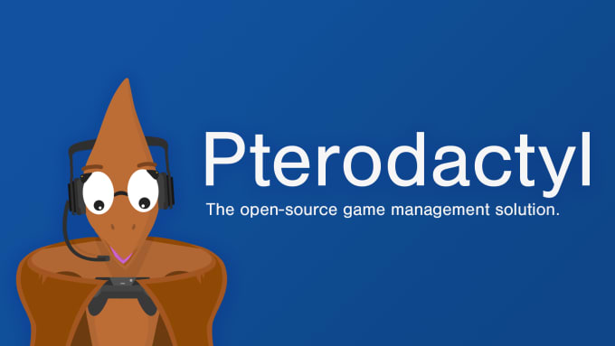

# ⚙ Introduction

### 1. Introduction

#### Purpose of this Documentation

Welcome to the MySQL and Pterodactyl Integration Documentation. This document is designed to be a comprehensive guide to understanding and implementing the integration of MySQL with Pterodactyl, a game server management platform. Whether you are an administrator managing game servers, a developer working on integration, or a system user interested in the underlying technologies, this documentation will provide the information you need to get started, configure the integrated system, and troubleshoot common issues.

#### Target Audience

This documentation caters to a diverse audience, including:

* Game server administrators looking to optimize their server management using MySQL and Pterodactyl.
* Developers interested in integrating MySQL with Pterodactyl for enhanced data management and performance.
* Users who wish to understand the technology behind the integration for better utilization and customization.

<figure><figcaption></figcaption></figure>
